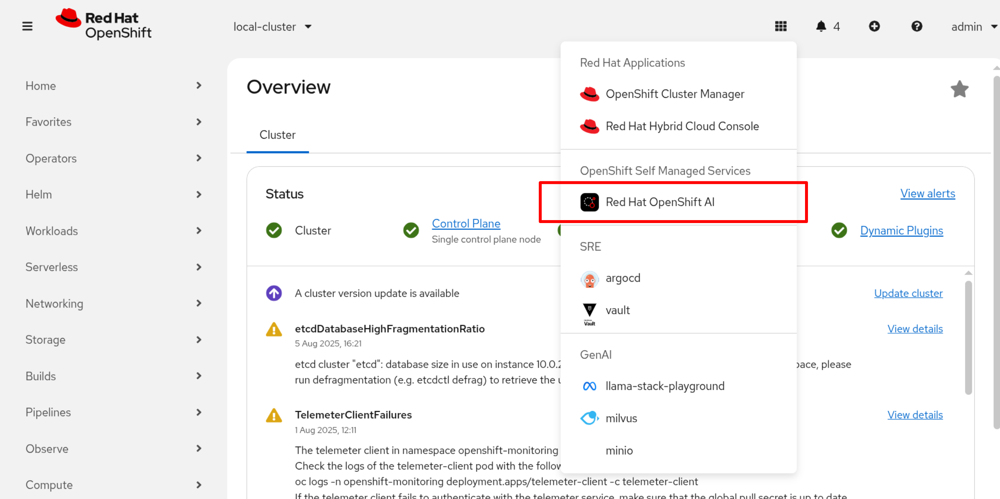
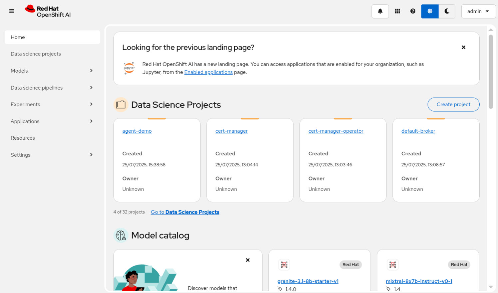
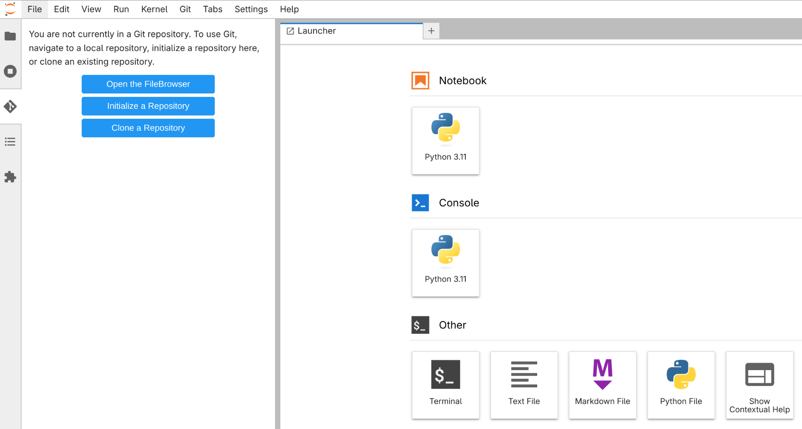
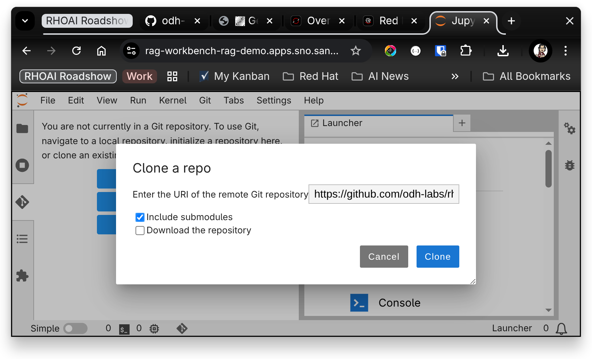

# 💁 Introduction

We are going to cover the basics to get started with RHOAI. Feel free to skip this section if you are already familiar with the the RHOAI UX.

This workshop uses JupyterLab for most of the activities. In this exercise we will:

1. Connect to the workshop environment

2. Create the OpenShift AI **Project** that you will use for the entire workshop.

3. Create a **Workbench** for you to do your work

4. Get familiar with the JupyterLab environment

## Login to OpenShift AI

**Pre-requisites:** You have logged on to OpenShift.  

After logging on to OpenShift you will open the OpenShift AI platform from the Applications menu.  
1. Click the **Applications** menu button in the OpenShift toolbar.  

    

2. Click **Red Hat OpenShift AI**.  
   📝 Note: In this workshop we have not enabled single sign-on so OpenShift AI will prompt you to log in.  

3. Log in using the credentials for the workshop:  
      **Username:** (You will be provided with the username on the day.)  
      **Password:** (You will be provided with the password on the day.)  

4. Click **Login**  

   OpenShift AI displays the main console.

    

## Create a project

1. Click the **Create project** button on the top right of the display.

2. Type `ai-roadshow` in the **Name** text box.

      

3. Click **Create**

OpenShift AI creates an empty project.

      

## Create a workbench

1. Click **Create a workbench** in the *Workbenches* group box.  
   OpenShift AI prompts you to complete the *Workbench* details.  

2. Enter the following details into the *Create workbench* form:  

    Name: **getting-connected**  
    Image Selection: **Minimal Python**  
    Version: **2025.1 (Recommended)**  
    Hardware profile: **Small**  

    Leave all other settings as defaults.

    

    Review the information you have entered

3. Click **Create workbench**

    OpenShift AI creates and starts the workbench.

    

    Wait for the status to change to *Running*.  

    The workbench has now been created. You will now open the workbench, which will launch **JupyterLab**, your IDE for the lab.  

## Open the Jupyter notebook

1. Click **getting-connected** to open *JupyterLab*.

   In the login dialog box, enter the same credentials you used to log into OpenShift at the start of this lab.

2. Click **Login**

   OpenShift AI launches JupyterLab.

    With JupyterLab now running, you will now download all of the lab materials:  

3. Click the **Git** button in the toolbar on the left side of JupyterLab.  

      

4. Click **Clone a Repository**

   OpenShift AI prompts you to enter the repository URL and other options.  

5. Copy and paste the following into the *URI of the remote Git repository* text box: `https://github.com/odh-labs/rhoai-roadshow-v2.git`  

6. Click **Include submodules**.

    

7. Click **Clone**.

    JupyterLab copies the source code from GitHub into your Workspace.

    

8. In the *File Explorer* panel, navigate into the directory: `/rhoai-roadshow-v2`

    

9. Double click **0-get-connected.jupyterlab-workspace** to open the workspace for this activity.  
   JupyterLab opens the workspace. All of the notebooks you will use are visible in the *File Explorer*.  

    

When done, you have successfully connected to your environment.

## Get familiar with JupyterLab

### Running code in a notebook

📝 NOTE: If you're already at ease with Jupyter Notebooks, you can skip to the next section.

A notebook is an environment where you have _cells_ that can display formatted text or code.

This is an empty cell:

This is a cell with some code:

Code cells contain Python code that you can run interactively. You can modify the code and then run it. The code does not run on your computer or in the browser, but directly in the environment that you are connected to.

You can run a code cell from either the notebook interface or from the keyboard:

* **From the JupyterLab console,** select the top-most cell (by clicking inside the cell or to the left side of the cell) and then click **Run** from the toolbar.

* **From the keyboard:** Press **CTRL**+**ENTER** to run a cell or press **SHIFT**+**ENTER**`** to run the cell and automatically select the next one.

After you run a cell, you can see the result of its code as well as information about when the cell was run, as shown in this example:

When you save a notebook, the code and the results are saved. You can reopen the notebook to look at the results without having to run the program again, while still having access to the code.

### Notebooks blend code with documentation

Notebooks are so named because they are like a physical _notebook_: you can take notes about your experiments (which you will do), along with the code itself, including any parameters that you set. You can see the output of the experiment inline (this is the result from a cell after it's run), along with all the notes that you want to take (to do that, from the menu switch the cell type from `Code` to `Markdown`).

### Try It

Now that you know the basics, give it a try!

#### Procedure

In your workbench:

1. In the _File Explorer_ open the notebook called: <a href="https://github.com/odh-labs/rhoai-roadshow-v2/blob/main/docs/0-getting-connected/notebook/0-first-jupyter-notebook.ipynb" target="_blank">0-first-jupyter-notebook.ipynb</a>

2. Experiment by, for example, running the existing cells, adding more cells and creating functions.  

    You can do what you want - it's your environment and there is no risk of breaking anything or impacting other users. This environment isolation is also a great advantage brought by {rhoai}.

    * Optionally, create a new notebook in which the code cells are run by using a Python 3 kernel:
    * Create a new notebook by either selecting **File > New > Notebook** or by clicking the Python 3 tile in the Notebook section of the launcher window:  

    

    You can use different kernels, with different languages or versions, to run in your notebook.

## Additional resource

* If you want to learn more about notebooks, go to https://jupyter.org.

## End of activity

Congratulations and this completes this activity. Click the link below to move to the next activity.
