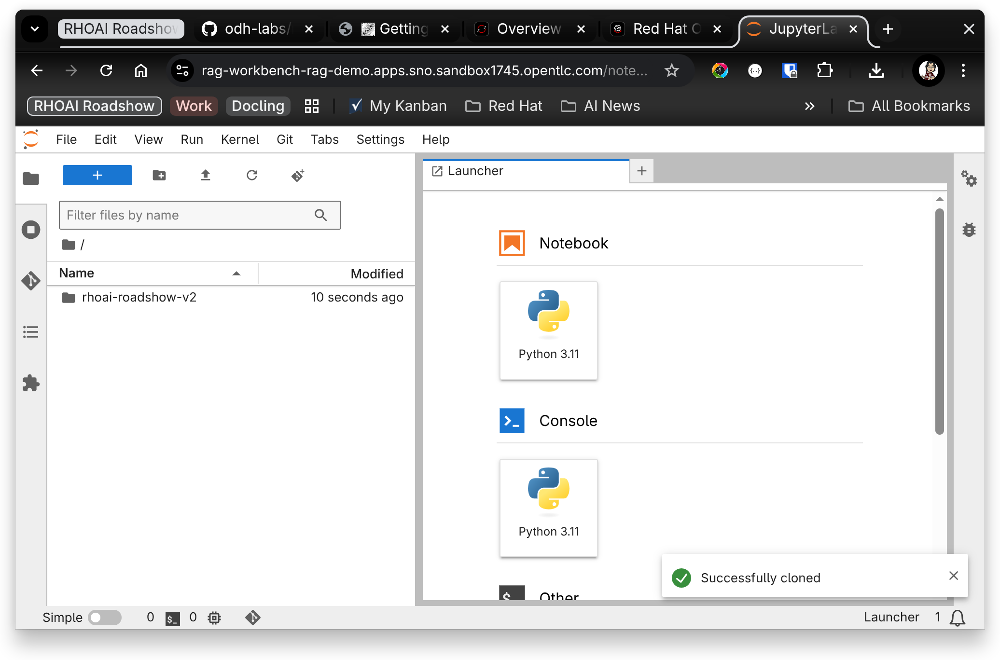
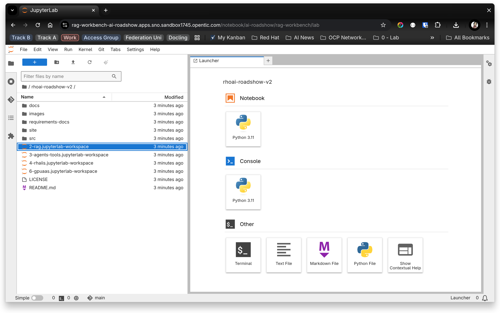

# 💁 Introduction

In this exercise we will configure the workbench that you will use for the lab. Follow the steps described in this document to configure the lab environment.

# Create a workbench

1. Login to OpenShift AI and select the `rag-demo` data science project.

2. Enter the folling details into the **Create workbench** form:

   Name: **rag-workbench**  
   Image Selection: **CUDA**  
   Version: **2025.1 (Recommended)**  
   Hardware profile: **NVIDIA L4 (Shared)**  

---

## Enter the S3 storage credentials

3. Scroll down to the **Add a connection** section 

1. Click the **Create connection** button.
2. Click **S3 compatible object storage - v1** from the *connection-type* drop-down list.
3. Enter the following details into the form:  
   Connection name: **rag-s3-storage**  
   Access key: **minio**  
   Secret key: **minio1234**  
   Endpoint: **minio.minio.svc.cluster.local:9000**  
   Region: **none**  
   Bucket: **rag-docs**  

Review the information you have entered:

5. Click **Create**.

⚠️ **Note:** You may receive a warning from your browser informing you of a weak password. You can safely ignore that warning.

6. Click **Create workbench**

OpenShift AI creates and starts the workbench.

Wait for the status to change to *Running*.  

The workbench has now been created. You will now open the workbench, which will launch **JupyterLab**, your IDE for the lab.  

---

# Open the Jupyter notebook

1. Click **rag-workbench** to open **JupyterLab**.  
   In the login dialog box, enter the same credentials you used to log into OpenShift at the start of this lab.

2. Click **Login**  
   OpenShift AI launches JupyterLab.  

With JupyterLabnow running, you will now download all of the lab materials:  
3. Click **Clone a Repository**  
   OpenShift AI prompts you to enter the repositor URL and other options.  

4. Paste the following URI text box: `https://github.com/odh-labs/rhoai-roadshow-v2.git`  
5. Click **Include submodules**.  

 

5. Click **Clone**.  

JupyterLab copies the source code from GitHub into your Workspace.

 

In the File Explorer panel, navigate to the directory:  
`/rhoai-roadshow-v2/docs/2-rag/notebook`  

  

When done, you can close the notebook and head to the next page.