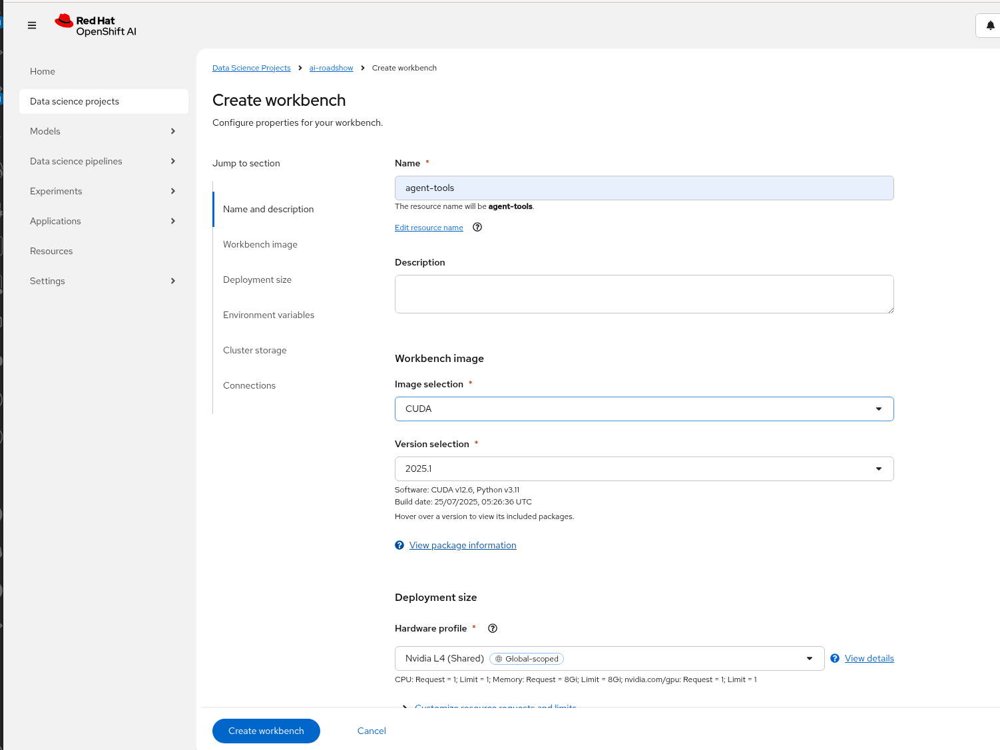
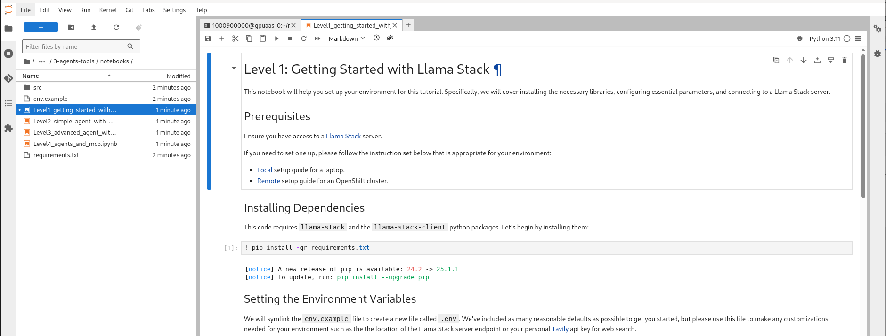

# Getting Started

## Create a workbench

Login to OpenShift AI and select the `ai-roadshow` data science project.


We are going to `Create a workbench` using the following parameters:

    Name: agent-tools
    Image Selection: CUDA
    Version: 2025.1 (select the latest version)

Leave all the other fields as defaults. You should see the `Hardware profile` auto-selected to use the GPU Accelerator `Nvidida L4 (Shared)`.



Select `Create workbench`.

## Open the first notebook in your workbench

Go into the `rhoai-roadshow-v2` folder and open the top level `3-agents-tools.jupyterlab-workspace` workspace.

Clone the code using your github user into your workbench by using the `Terminal` and entering:

```bash
git clone https://github.com/odh-labs/rhoai-roadshow-v2
```


Open up the following notebook in your workspace.

<a href="https://github.com/odh-labs/rhoai-roadshow-v2/blob/main/docs/3-agents-tools/notebooks/Level1_getting_started_with_Llama_Stack.ipynb" target="_blank">Level1_getting_started_with_Llama_Stack.ipynb</a>

In this notebook we will help you set up your environment for this tutorial.

We will cover installing the necessary libraries, configuring essential parameters, and connecting to a Llama Stack server.


