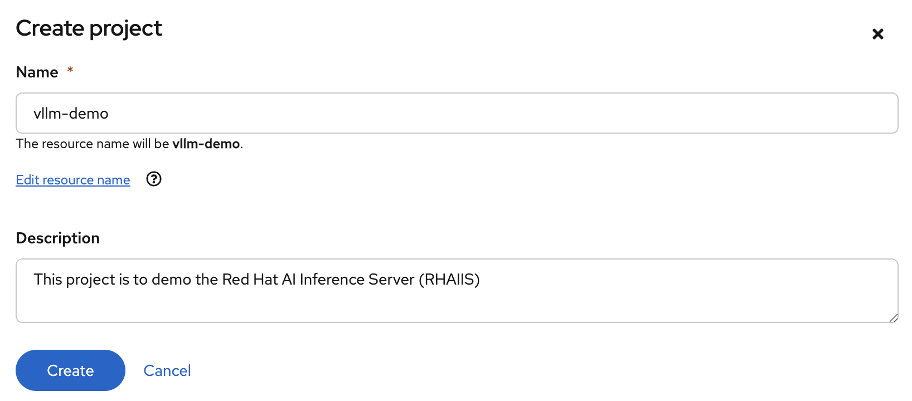

# Introduction

## Create a project

Login to OpenShift AI and click "create project". Give it a name "vllm-demo" and add "This project is to demo the Red Hat AI Inference Server (RHAIIS)" as description (Optional).

Click "Create".

## Create a workbench

Select the `vllm-demo` data science project we just created, click `Create a workbench`.

We are going to `Create a workbench` using the following parameters:

    Name: vllm
    Image Selection: CUDA
    Version: 2025.1 (select the latest version)
   
Leave all the other fields as defaults. You should see the `Hardware profile` auto-selected to use the GPU Accelerator `Nvidida L4 (Shared)`.

Click `Create workbench`.

Wait until the status of workbench is changed to `Running`.

Click the name of the workbench `vllm`, and it will bring you to JupyterLab web console as below.
