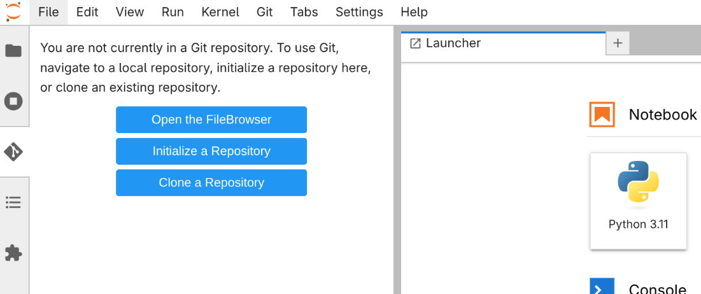
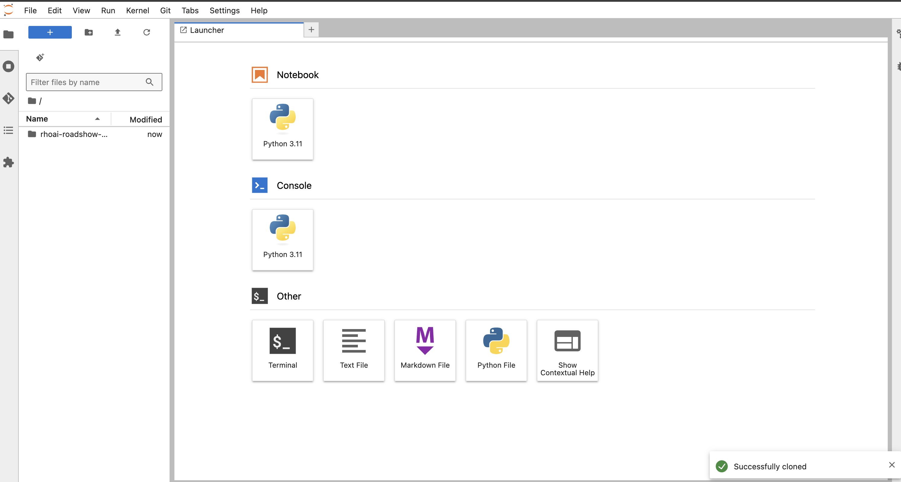

# 💁 Introduction

In this exercise we will configure the workbench that you will use for the lab. Follow the steps described in this document to configure the lab environment.

# 1. Create a project

Login to OpenShift AI and click "create project". Give it a name "vllm-demo" and add "This project is to demo the Red Hat AI Inference Server (RHAIIS)" as description (Optional).

Click "Create".

# 2. Create a workbench

Select the `vllm-demo` data science project we just created, click `Create a workbench`.

We are going to use the following parameters:

    Name: vllm
    Image Selection: CUDA
    Version: **2025.1 (select the latest version)
   
Leave all the rest as defaults. You should see the `Hardware profile` auto-selected to use the GPU Accelerator `Nvidida L4 (Shared)`.

Click **`Create workbench`**.

OpenShift AI creates and starts the workbench.

Wait until the status of workbench is changed to **`Running`**.

The workbench has now been created. You will now open the workbench, which will launch **JupyterLab**, your IDE for the lab.  

# 3. Open the Jupyter notebook

1. Click **vllm** to open **JupyterLab**.  
   In the login dialog box, enter the same credentials you used to log into OpenShift at the start of this lab.

2. Click **Login**  
   OpenShift AI launches JupyterLab.  

With JupyterLab now running, you will now download all of the lab materials:  

3. Click **Clone a Repository**  
   OpenShift AI prompts you to enter the repositor URL and other options.  

4. Paste the following URI text box: `https://github.com/odh-labs/rhoai-roadshow-v2.git`  
5. Click **Include submodules**.  

 

5. Click **Clone**.  

JupyterLab copies the source code from GitHub into your Workspace.

 

In the File Explorer panel, navigate to the directory:  
`/rhoai-roadshow-v2/docs/4-rhaiis/notebook`  

  

You are now ready to move on to the next section.
