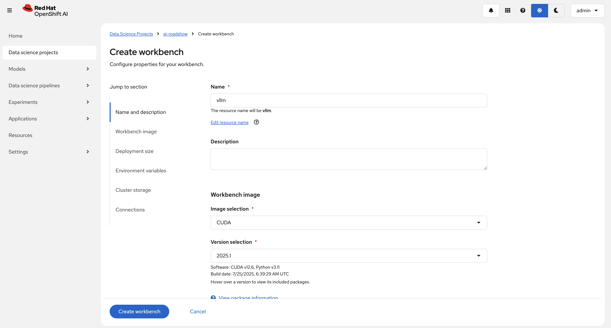
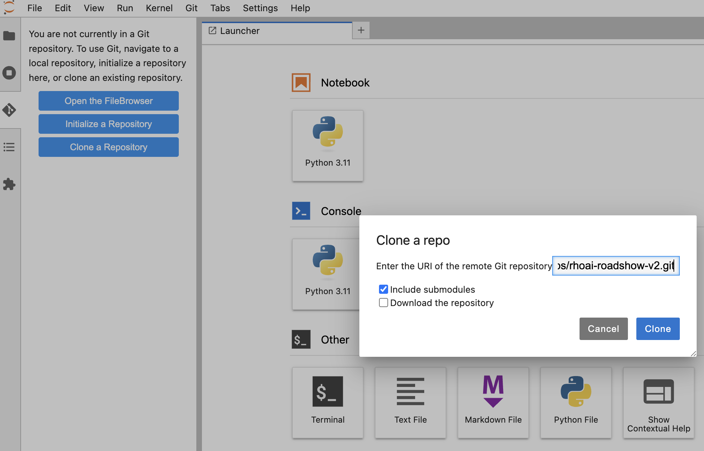

# 💁 Introduction

In this exercise we will configure the workbench that you will use for the lab. Follow the steps described in this document to configure the lab environment.

# Login to OpenShift AI

Your instructor will supply you with a link that you will use to login to your OpenShift AI cluster.

1. Open the OpenShift AI console using the url provided by your instructor.  
2. Use the following credentials to login to OpenShift AI:  
      **Username:** *admin*  
      **Password:** *password*

# Create a workbench

3. Select the `ai-roadshow` data science project.
    
   
4. Click **Create a workbench** in the **Workbenches** group box.  
   OpenShift AI displays a form to enter the workbench details.

5. Enter the following details into the **Create workbench** form:   
   Name: **vllm**  
   Image Selection: **CUDA**  
   Version: **2025.1 (Recommended)**  
   Hardware profile: **NVIDIA L4 (Shared)**  

    

6. Add the **environment variables** as illustrated below.  Please reflect to your own environment been created for your lab.

    

7. Click **Create workbench**  
   OpenShift AI proceeds to create the `vllm` **Workbench**.  
   Monitor the **Status** of the workbench until it changes to `Running`.

    

## Open the workbench

1. In the **Workbenches** list, Click `vllm` in the **Name** column.  
    OpenShift AI launches the Jupyter Notebook.  

2. Enter the **username** and **password** you were supplied for this lab.  

3. Click **Login**.  
    OpenShift AI launches JupyterLab. This will be the IDE thaat you use for the rest of the lab.

    

    With JupyterLab now running, you will now download all of the lab materials:  

4. Click **Clone a Repository**  
   OpenShift AI prompts you to enter the repositor URL and other options.  

5. Copy and paste the following URI into the text box: `https://github.com/odh-labs/rhoai-roadshow-v2.git`

6. Click **Include submodules**.  

     

7. Click **Clone**.  

    JupyterLab copies the source code from GitHub into your Workspace.

    

8. Go into the `rhoai-roadshow-v2` folder and open the top level `4-rhaiis.jupyterlab-workspace` workspace.

    You are now ready to move on to the next section.
