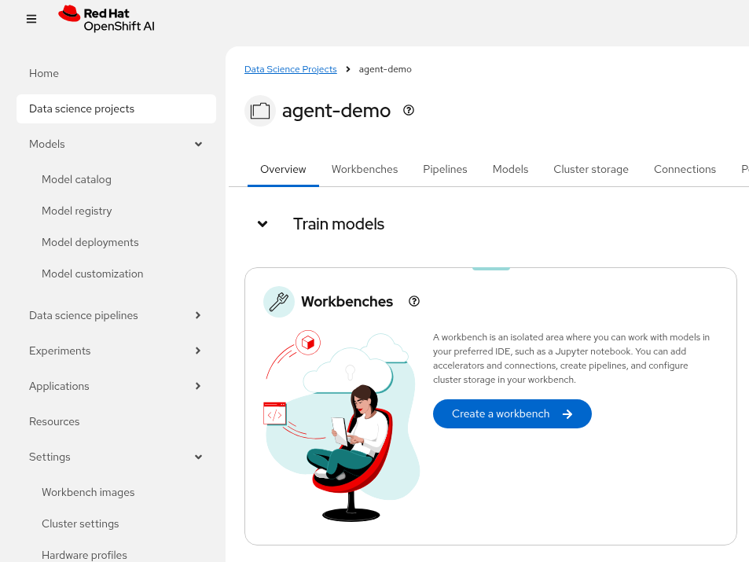
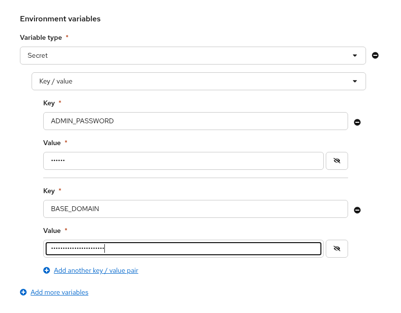

# Introduction

## Create a workbench

Login to OpenShift AI and select the `agent-demo` data science project.



We are going to `Create a workbench` using the following parameters:

    Name: gpuaas
    Image Selection: CUDA
    Version: 2025.1 (select the latest version)

For this workbench we need to use storage than can be used in an AWS ZONE that is not the same as the SNO master node.

By default the `lvms-vgsno` storage class is only useable on the Single Node Master (SNO).

`gp3` storage is still not shareable across AZs but we at least we can provision our GPU node in another AZ if there are resource shortages.

Create a Persistent Volume Claim for our new Notebook using the `gp3-csi` cloud storage class.

Paste the following YAML into the OpenShift Console to create the PVC for our workbench - use the **+** sign up on the top right on the OpenShift we console (quick create).

```yaml
apiVersion: v1
kind: PersistentVolumeClaim
metadata:
  annotations:
    openshift.io/display-name: gpuaas-storage
  labels:
    opendatahub.io/dashboard: "true"
  name: gpuaas-storage
  namespace: agent-demo
spec:
  accessModes:
  - ReadWriteOnce
  resources:
    requests:
      storage: "40Gi"
  storageClassName: gp3-csi
  volumeMode: Filesystem
```

You need to `Detach` the automatic `gpuaas-storage` storage, then - Select `Attach existing storage` using the PVC we created above when creating the workbench.


Add the following `Environment Variables` to your workbench.

    ADMIN_PASSWORD: your OpenShift admin password
    BASE_DOMAIN: your OpenShift lab base domain e.g sandbox.opentlc.com




Leave all the other fields as defaults. You should see the `Hardware profile` auto-selected to use the GPU Accelerator `Nvidida L4 (Shared)`.


Select `Create workbench`.
